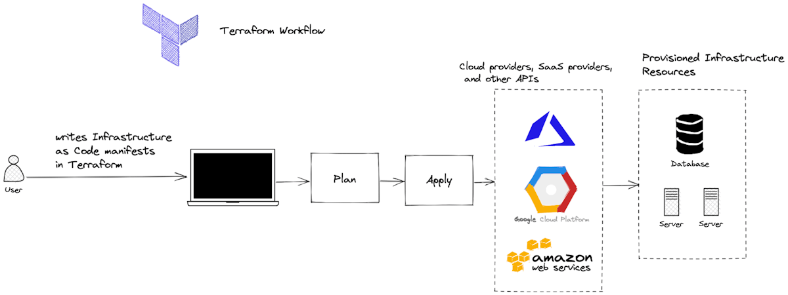

# DataEngPlayGround
- spin-off for https://github.com/BNSBNS/ToyProjectAIML built to simplified and understand process first.

## Starter project for DE involving:

1) Terraform, aws cli 

potential issues:
> “a state file falls out of date frequently and needs refresh repeatedly. When sharing it remotely with a team, we have to handle racing condition, i.e. concurrent apply, or plan during apply. In addition, a state file contains sensitive data so we must protect access.”

2) Batch with Glue/EMR/lambdas

3) Stream with Kinesis

4) Maybe Lambda

5) EMR
  
6) GLUE

